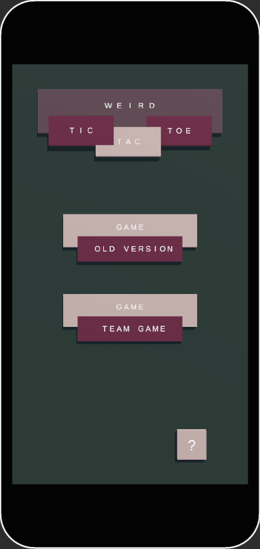

# 🌀 Tic Tac Toe – Weird Edition 🌀

🥶 A pretty good horror of statistical methods.  
💔 Can cause a heart attack.  
🤯 It works – somehow.  

---

## 📖 Overview

**Tic Tac Toe – Weird Edition** is a creative twist on the classic Tic Tac Toe game that lets players customize almost every aspect of the gameplay.
You can set up multiple players, choose the number of columns and rows, and define how many fields must be crossed to win (the *victory condition*). Each player can also change their default symbol for a personalized experience.

If the board is too small, the game automatically displays help buttons and default board text — both of which can be toggled on or off from the in-game menu (indicated by upside-down triangle buttons).
The menu also allows players to start a new game or return to an ongoing one.

---

## ⚙️ Game Modes

Tic Tac Toe – Weird Edition includes two main modes: **Cellphone Mode** and **Tablet Mode**.

### **Cellphone Mode**

* Up to **6 players**.
* Up to **9 columns** and **9 rows**.

### **Tablet Mode**

* Up to **12 players**.
* Up to **15 columns** and **15 rows**.

---

## 🤝 Team Play

The game also supports **team-based matches**.

### **Cellphone Mode**

* **2 teams**.
* Up to **3 players per team**.

### **Tablet Mode**

* Up to **6 teams**.
* Up to **6 players per team**.

---

## ⏰ Timer Options

Timers add an extra challenge and randomness to the gameplay:

* Randomly change player symbols.
* Change symbols for all players.
* Change symbols between teams.

**Timer countdown** ranges from **5 to 75 seconds**.
Players have **5 seconds** to memorize symbol changes — this setting cannot be modified.
When the countdown reaches zero, the timer turns off automatically.

In traditional mode, only **one timer** can be active.
In **team games**, up to **two timers** can be used simultaneously.

---

## ➕ Additional Features

The **TEAM MOVES** button is displayed only when the teams have different numbers of players.

**TEAM 1 symbols:** `O`, `X`  
**TEAM 2 symbols:** `W`, `T`, `A`

### Team Moves: `=`

- Both teams have the same number of players.
- Symbol change sequence:  
  `O → W → X → T → A → O → W → X → T → A`

### Team Moves: `≠`

- The teams have a different number of players.
- Symbol change sequence:  
  `O → W → X → T → O → A → O → W → X → T → O → A`

---

## 📦 APK Downloads

The project includes **three Android APK versions**, built for **API levels 34, 35, and 36**.

You can find all APK versions here:

`docs/AndroidAPKs`

---

## 👉 Mobile Version

Here is a short preview of **Weird Tic Tac Toe** running on a mobile device:

  

